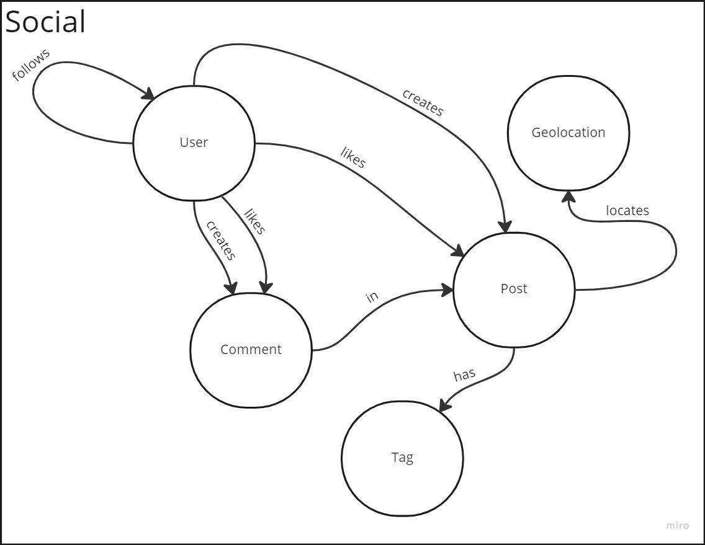
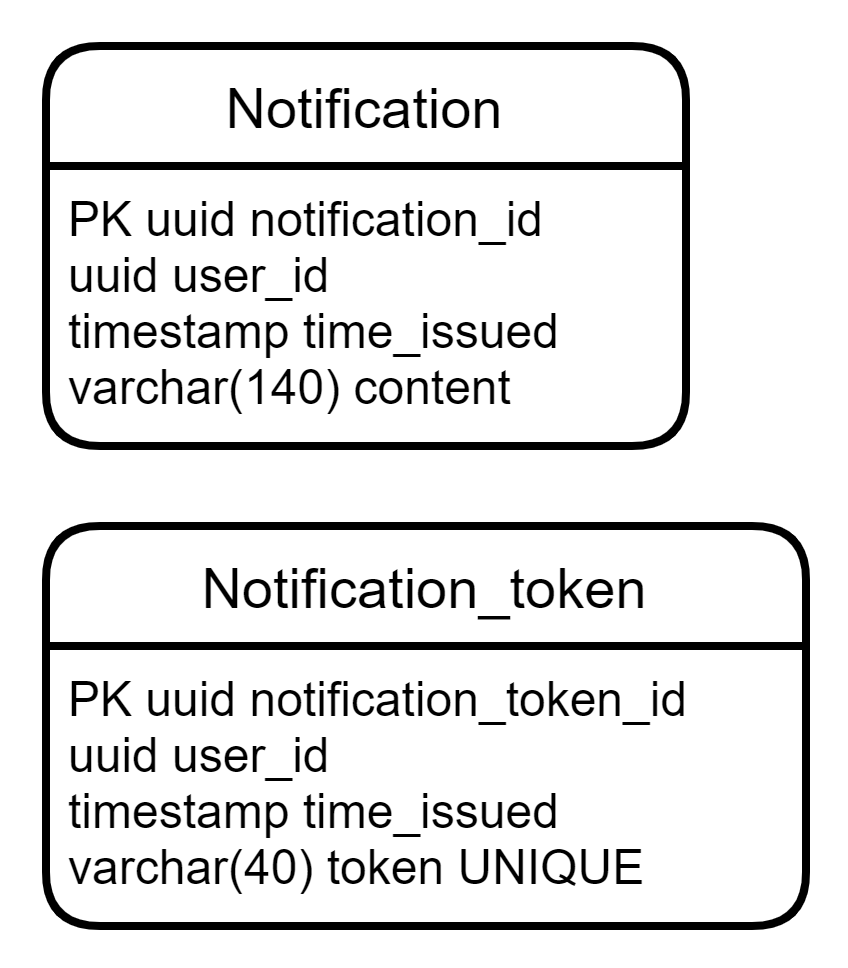

# naukma-aws

bla bla bla

# User service

gRPC cервіс користувачів, виконує роль зберження користувачі та їх аутнефікації.

## Сутності

```protobuf
message User {
  string email = 1;
  string nickname = 2;
  string password = 3;
  string phoneNumber = 4;
  bool emailConfirmed = 5;
  string description = 5;
  bool isHidden = 6;
  Timestamp registredAt = 7;
}
```

## routes

### POST: /api/user/auth/local/signup

Раут для створення користувача, приймає

```protobuf
message UserSignupRequest {
  string email = 1;
  string nickname = 2;
  string password = 3;
  string phoneNumber = 4;
}
service UserService {
  rpc SigninRequest(SigninRequest) returns(JwtTokenPair);
}
```

Після збереження користувача в базу буде викликаний івент user.created

### PATCH: /api/user/{:id}

Раут для зміни профілю користувача

```protobuf
message UserUpdateRequest {
  uuid userId = 1;
  string nickname = 2;
  string password = 3;
  string description = 5;
}
service UserService {
  rpc SigninRequest(UserUpdateRequest) returns(User);
}
```

Після збереження користувача в базу буде викликаний івент user.updated

### POST: /api/user/auth/local/signin

Стратегія аутнефікації така, використовується jwt токени, refresh та access,

```protobuf
message JwtTokenPair {
  string accessToken = 1;
  string refreshToken = 2;
}
```

В access payload зберігаються такі поля як id користувача, його нікнейм, та sessionId Цей sessionId буде поміщений в кеш
сесії. Цей токен живе всього 15 хв і після 15 хв ключ з кешу буде інвалідовано. Цей кеш спійльний разом з Edge service.
В refresh token генерується uuid та йде в базу даних разом з часом створення.

```protobuf
message SigninRequest {
  string email = 1;
  string password = 2;
}
service UserService {
  rpc SigninRequest(SigninRequest) returns(JwtTokenPair);
}
```

### POST: /api/user/auth/refresh

Разом з рефреш токеном можна за допомогою refreshToken, така ж логіка наче ми наново авторизуємося, тільки на цей раз ми
використовуємо refreshToken

```protobuf
message RefreshTokenRequest {
  string refreshToken = 1;
}
service UserService {
  rpc RefreshTokens(RefreshTokenRequest) returns(JwtTokenPair);
}
```

# Media service

Медіа сервіс для збереження картинок та аватарок. Всі картинки зберігаються в сервісі AWS S3.

### grpc

```protobuf
message UploadImageRequest {
  bytes image = 1;
}
service UserService {
  rpc UploadImage(stream UploadImageRequest) returns(JwtTokenPair);
}
```

# Social service

gRPC сервіс для побудови зв'язків між юзерами, їх постами, постами та коментарями, що їм подобаються, а також тегами та
геолокаціями постів та постами. Використовується графова база даних Neo4j. Запропонована схема дозволяє ефективно
доступатися до постів користувача та його підписок та постів, що мають спільні з постами користувача теги та геолокації.
Слухає івент user.created і створює для цього користувача ноду. Також при підписці користувача на іншого користувача
створюється edge. Подібним чином сервіс оброблює і лайки користувача. Працює batch job, що продукує івенти з інформацією
про кількість лайків на пості. При створенні поста, сервіс отримує інформацію (автора, хештеги, геолокацію) і створює
відповідні зв'язки. Продукує події про лайки на пости/коментарі користувача (до Kafka), про нових підписників тощо.

схема даних бд:



# Activity log service

Збирає та оброблює дані про активність користувача і продукує відповідні події в Kafka, наприклад подія log.user-online
сповіщатиме сервіси, асинхронно зв'язані з даним через Kafka про те, що користувач online.

# Notification service

Слухає івенти від Social та додає нотіфікейшн в бд та відправляє в AWS SNS, також збирає токени (дозволи на відправку)
користувача. Використовує PostgreSQL



### models

```protobuf 
message Notification {
    uuid id = 1;
    string message = 2;
    User publisher = 3;
    uuid userId = 4;
    Timestamp createdAt = 4;
}

message Token {
    uuid userId = 1;
    string token = 2;
}
```

# Comment sevice

Сервіс для збереження коментарів під пост.

Використовує PostgreSQL

.png)

### models

```protobuf 
message Comment {
    uuid userId = 1;
    uuid postId = 2;
    string message = 3; 
    Timestamp timePublished = 4;
}
```

# Posts related services

## Post

Post - зберігає пости.

Використовує PostgreSQL.

Слухає події про лайки на пости від Social, відповідно оновлює таблицю User_likes_post, періодичний batch_job підраховує
кількість лайків та оновлює таблицю Post.

Продукує подію post.updated в разі оновлення інформації у пості для сповіщення про це сервісів, що її дублюють.


.png)

```protobuf 
message Post {
    uuid postId = 1;
    User user = 2;
    string photoLocation = 3;
    string description = 4;
    uint32 likeCount = 5;
    Timestamp timeCreated = 6;
    repeated string hashTags = 7;
}
```

```protobuf 
message CreatePostRequest { 
    User user = 2;
    string photoLocation = 3;
    string description = 4;
}
message UpdatePostRequest { 
    string description = 4;
}
message DeletePostRequest { 
    uuid postId = 1;
}
message GetPostRequest { 
    uuid postId = 1;
}
message GetPostsRequest { 
    uuid userId = 1;
}
service PostService {
    // produces event post.created
    rpc CreatePost(CreatePostRequest) returns(Post);
    // produces event post.updated
    rpc UpdatePost(UpdatePostRequest) returns(Post);
    rpc DeletePost(DelelePostRequest) returns(bool);
    rpc GetPost(GetPostRequest) returns(Post);
    rpc GetPosts(GetPostsRequest) returns(Post);
}
```

## Feed Service

Сервіс, що створю і зберігає subscription feed користувача. Утворення відбувається через batch job кожні 10-15 хвилин на
основі інформації про пости користувачів, чиїм фоловером є даний користувач із мікросервісу Social.

Використовує Redis.

Зберігає дані у форматі:

uuid of user : array of uuids of posts

```protobuf 
message GetFollowsFeedRequest { 
    uuid userId = 1;
}
service FeedService {
    rpc Follows(GetFollowsFeedRequest) returns(Post[]);
}
```

## Recommendations service

Сервіс, що створю і зберігає subscription feed користувача. Утворення відбувається через batch job кожні 10-15 хвилин на
основі інформації про пости користувачів, чиїм фоловером є даний користувач із мікросервісу Social.

Використовує Redis.

Зберігає дані у форматі:

uuid of user : array of uuids of posts

```protobuf 
message GetFollowsFeedRequest { 
    uuid userId = 1;
}
service FeedService {
    rpc Follows(GetFollowsFeedRequest) returns(Post[]);
}
```

## Search Service

Сервіс для швидкого пошуку за користувачів за юзернеймом або постів за хештегами. Використовується пошукова база даних
ElasticSearch. Зберігає лише ті дані, за якими можна здійснювати пошук, а також id. Створює записи при івентах
user.created та post.created. При пошуковому запиті емітить івент із знайденими результатами (список айді юзерів або
постів), щоб за цими айдішниками знайти повні записи.

```protobuf 
message SearchUsersRequest { 
    string pattern = 1;
}
message SearchHashTagsRequest { 
    repeated string tags = 1;
}

service SearchService {
    rpc SearchUsers(SearchUsersRequest) returns(User[])
    rpc SearchHashtags(SearchHashTagsRequest) returns(Post[])
}
```
